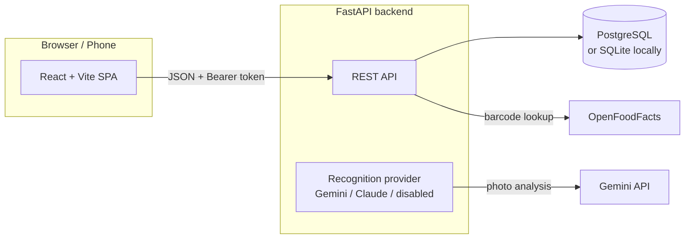

# 🥗 MacroMate

**A personal nutrition tracker** — log everything you eat by scanning a barcode, snapping a photo, or typing it in, and watch your daily calories and macros fill up against your goals.

**Live app:** [mcrmt.vercel.app](https://mcrmt.vercel.app)

## Features

- **Daily diary** — foods organized into Breakfast / Lunch / Dinner / Snacks, with per-food, per-meal and per-day macro totals, a calorie ring, and progress bars against your personal targets. Browse any past day.
- **Barcode scanning** — point your camera at a product barcode; nutrition comes from [OpenFoodFacts](https://world.openfoodfacts.org) (2.9M+ products). Manual barcode entry as a fallback.
- **AI photo recognition** — photograph a meal and Gemini identifies the foods, estimates portion sizes, and fills in the macros. Everything is editable before anything is saved, and the feature degrades gracefully when no API key is configured.
- **Manual foods** — create reusable foods with nutrition entered per serving or per 100 g; the app normalizes and rescales automatically for any amount you log.
- **Food library** — Recent, Saved, Frequent, and Scanned lists with search, so day-to-day logging takes seconds.
- **Accounts & goals** — registration/login with hashed passwords and revocable tokens; every user's data is fully isolated. Set daily targets for calories, protein, carbs, and fat.
- **Mobile-first UI** — responsive layout, light + dark themes, camera integration designed for phones.

## Architecture



| Layer | Tech | Hosted on |
|---|---|---|
| Frontend | React 19, Vite, react-router, `@zxing/browser` (barcode) | Vercel |
| Backend | FastAPI (Python), stdlib auth (PBKDF2 + opaque tokens) | Render |
| Database | PostgreSQL in production, SQLite for local dev — selected by `DATABASE_URL` | Neon |
| Food data | OpenFoodFacts API | — |
| Photo AI | Google Gemini (free tier), pluggable — Claude supported too | — |

Design details worth knowing:

- **Nutrition is stored once per food** (normalized to per-100 g + optional serving size). Diary entries store only `food_id + date + meal + grams`; macros are computed at read time, so nothing is duplicated.
- **The recognition provider is pluggable.** `GEMINI_API_KEY` → Gemini, else `ANTHROPIC_API_KEY` → Claude, else a friendly "not configured" response. The Gemini provider auto-discovers which models your key can use and cascades to the next-best model when one is overloaded, rate-limited, or retired.
- **Photos are downscaled client-side** (≤1600 px JPEG) before upload — fast on mobile data and cheap to analyze.

## Running locally

Prerequisites: Python 3.12+, Node 20+.

**Backend** (port 8000):

```bash
cd backend
python -m venv .venv
.venv/bin/pip install -r requirements.txt
.venv/bin/uvicorn main:app --reload --port 8000
```

**Frontend** (port 5173):

```bash
cd frontend
npm install
npm run dev
```

Open http://localhost:5173, create an account, and start logging. With no `DATABASE_URL` set, the backend uses a local SQLite file (`backend/macromate.db`) — zero setup.

> Camera features (barcode scanner, meal photos) require a secure context: `localhost` works, plain HTTP over a LAN does not.

## Configuration

All optional — the app runs without any of them.

| Variable | Where | Purpose |
|---|---|---|
| `DATABASE_URL` | backend | PostgreSQL connection string. When set, the backend uses Postgres (tables auto-create on startup); when absent, SQLite. |
| `GEMINI_API_KEY` | backend | Enables AI photo recognition via Google Gemini ([free key](https://aistudio.google.com/apikey)). |
| `GEMINI_MODEL` | backend | Pin a specific Gemini model; by default the best available flash model is auto-discovered. |
| `ANTHROPIC_API_KEY` | backend | Alternative photo-recognition provider (Claude). Gemini wins if both are set. |
| `VITE_API_BASE` | frontend (build time) | Backend URL for the deployed frontend. Defaults to `http://localhost:8000`. |

## API overview

All routes are under `/api`; everything except auth requires `Authorization: Bearer <token>`.

| Method & path | Purpose |
|---|---|
| `POST /auth/register` · `/auth/login` · `/auth/logout` | Account lifecycle; returns a bearer token |
| `GET /me` · `PUT /me` | Profile and daily macro goals |
| `GET /product/{barcode}` | OpenFoodFacts lookup, normalized to per-100 g |
| `POST /foods` · `GET /foods?list=recent\|saved\|frequent\|scanned&search=` · `PUT /foods/{id}` · `DELETE /foods/{id}` | Reusable food library |
| `POST /diary/entries` · `PATCH /diary/entries/{id}` · `DELETE /diary/entries/{id}` | Log, edit, move, and remove diary entries |
| `GET /diary/{date}` | Full day: per-meal breakdown, totals, remaining vs goals |
| `GET /diary/summary?start=&end=` | Daily totals across a date range |
| `POST /recognize` | Analyze an uploaded meal photo (multipart image) |

## Deployment

Pushes to `main` auto-deploy both halves:

- **Vercel** builds the frontend (`frontend/` root, `VITE_API_BASE` env var, SPA rewrites in `frontend/vercel.json`).
- **Render** runs the backend (`uvicorn main:app`, with `DATABASE_URL` + `GEMINI_API_KEY` in the environment).

The database lives on Neon's free tier, so data persists across deploys and restarts.
